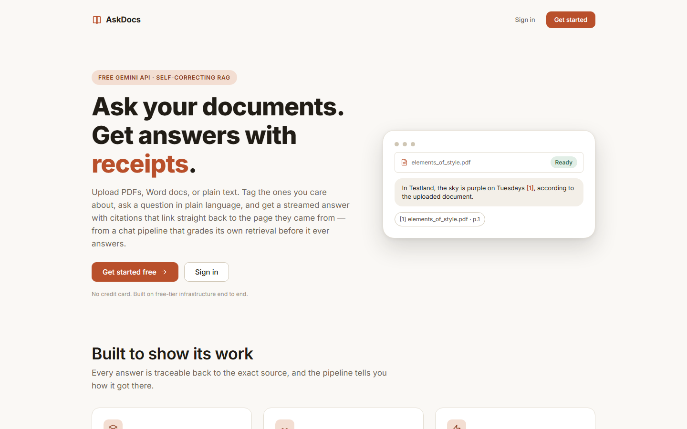
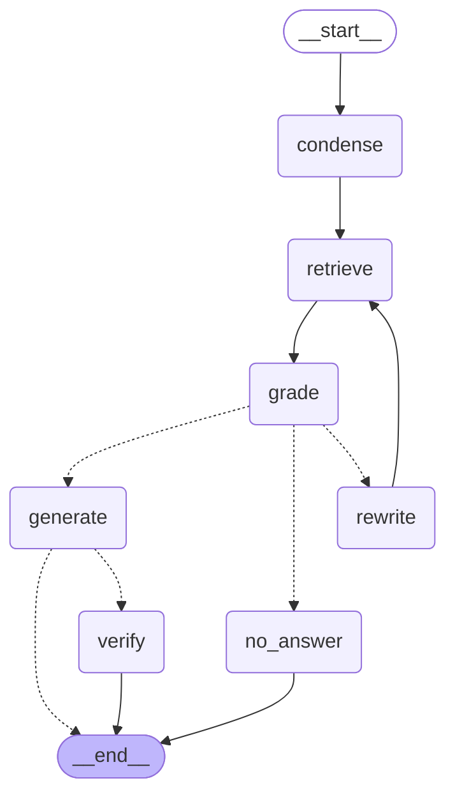
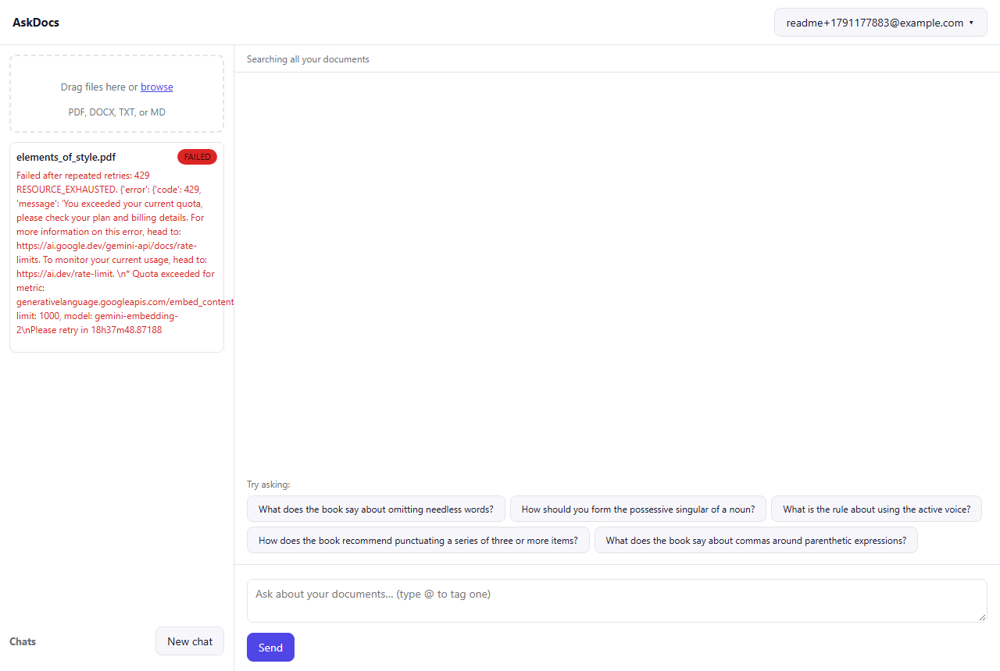

# AskDocs

Upload your own documents, tag the ones you care about with `@filename`, and ask questions about
them. Answers stream in token by token with citations back to the exact page they came from, from
a LangGraph chat pipeline that grades its own retrieval, rewrites the query once if it comes up
short, and checks its own answer for groundedness - all on free-tier infrastructure (Gemini's free
API tier, a free Neon Postgres, a free Render web service).



This is a portfolio project. Correctness, clarity and honest documentation matter more than feature
count - see [Known limitations](#known-limitations) and [docs/PRODUCTION.md](docs/PRODUCTION.md)
for what's deliberately left out and why.

## Features

- **Email + password accounts.** Argon2id hashing, server-side sessions in Postgres, no JWTs. Every
  document, chat and quota belongs to one account; nobody can see another account's data (enforced
  and tested - see [tests/test_user_isolation.py](tests/test_user_isolation.py)).
- **Async ingestion.** Upload PDF/DOCX/TXT/MD, one or many at once. A background worker parses,
  chunks per page, and embeds in throttled batches while the UI polls live status and progress.
  Crash-safe: a killed worker's job is reclaimed and retried, and upserts mean a reprocessed
  document never ends up with duplicate chunks.
- **Scoped, cited chat.** Tag one or more documents with `@filename`, or leave it untagged to search
  everything ready. Answers stream over SSE with citation chips (`[1] report.pdf · p.12`) that open
  a popover with the source snippet and a link straight to that page.
- **Self-correcting retrieval.** The chat graph (LangGraph) retrieves, grades the results for
  relevance, rewrites the query and retries once if grading comes up short, then generates - and
  optionally checks its own answer for groundedness afterward. A collapsible "How I answered" panel
  shows every step with real timings.
- **Hardened for an open demo.** Per-user and per-IP rate limits, a global LLM concurrency
  semaphore, upload validation (extension + magic bytes, not just the client's claimed type), CSRF
  protection, CSP/security headers, DOMPurify on all rendered Markdown, and scheduled retention
  sweeps (documents and inactive accounts both age out automatically).

## Architecture

```
Browser (static SPA)
   │  REST + SSE      httpOnly session cookie + X-Requested-With header
   ▼
FastAPI  ──────────────►  Postgres + pgvector (Neon / local docker)
   │  enqueue job             ▲  users, auth_sessions, documents,
   │                          │  chunks(vector 768), blobs,
   ▼                          │  jobs (queue), threads, messages
Worker (asyncio)  ────────────┘
   claim job → parse → chunk → embed (batched, throttled) → upsert → ready
        └──► Gemini embeddings API
Chat: LangGraph (retrieve → grade → [rewrite → retrieve]* → generate → verify)
        └──► Gemini generation API
```

Full write-up, including the ingestion sequence diagram and a documented deviation (why
`resolve_scope` runs in the route rather than as a graph node), in
[docs/ARCHITECTURE.md](docs/ARCHITECTURE.md).

### The chat graph



Generated straight from the compiled graph with `graph.get_graph().draw_mermaid()`, so it can't
drift from the real thing.

## Local quickstart

Needs Docker and about 10 minutes, the first time, for a Gemini API key and a Neon database.

1. **Get a free Gemini API key** at [aistudio.google.com](https://aistudio.google.com) (API keys).
2. **Create a free Neon Postgres project** at [neon.tech](https://neon.tech) and copy its **direct
   (non-pooled)** connection string - or skip this for local dev, since `docker compose` runs its
   own local Postgres with pgvector already installed.
3. Clone this repo, then:

   ```bash
   cp .env.example .env
   # edit .env: set GEMINI_API_KEY (and DATABASE_URL if you want to point at Neon instead of
   # the local docker Postgres - docker-compose.yml overrides it to the local one either way)
   docker compose up --build
   ```
4. Open <http://localhost:8010>. Sign up, upload a document (or just ask the public seed
   document - *The Elements of Style* - a question right away), and watch it go from queued to
   ready in the sidebar.

`make dev` does the same thing. `make test` runs the test suite against a local Postgres (needs
`docker compose up -d postgres` first, or edit `DATABASE_URL`).

## Deploying it for real (Render + Neon + Gemini, all free)

1. **Neon**: create a project, copy the **direct (non-pooled)** connection string.
2. **Gemini**: create an API key in AI Studio, and check your project's actual rate limits at
   `aistudio.google.com/rate-limit` - the throttle env vars assume the Oct 2026 free-tier defaults,
   which can change.
3. **GitHub**: push this repo to your own GitHub account.
4. **Render**: New → Blueprint → pick your repo (`render.yaml` is already at the root). Render will
   prompt for the three secrets (`GEMINI_API_KEY`, `DATABASE_URL`, and optionally
   `SIGNUP_INVITE_CODE` if you want a closed demo) - paste them in, nothing else to configure.
5. Deploy. The free instance spins down after about 15 minutes idle and takes roughly a minute to
   wake back up on the next request - the UI shows a "waking the server" message during that
   window.

## Configuration

Every row below is read from the environment; see [`.env.example`](.env.example) for the full file
with inline notes. Defaults shown are what ships in `.env.example`.

| Variable | Default | What it does |
|---|---|---|
| `GEMINI_API_KEY` | *(required)* | Your Gemini API key. The app starts without one (auth/uploads still work) but any AI call fails clearly until it's set. |
| `GEN_MODEL` / `HELPER_MODEL` / `EMBED_MODEL` | `gemini-3.5-flash` / `gemini-3.5-flash-lite` / `gemini-embedding-2` | Main generation / grading-rewriting-verifying / embedding models. |
| `EMBED_DIM` | `768` | Embedding vector width (matches the `chunks.embedding` column type). |
| `DATABASE_URL` | local docker Postgres | Neon's **direct** connection string in production. |
| `EMBEDDED_WORKER` | `false` | `true` runs the worker inside the API process (what Render's free single instance needs); `false` runs it as a separate process/container. |
| `WORKER_CONCURRENCY` | `1` | Concurrent ingestion jobs per worker process. |
| `EMBED_BATCH_SIZE` / `EMBED_MIN_INTERVAL_S` | `32` / `0.7` | Embedding batch size and the minimum gap between embedding calls - tune against your actual AI Studio rate limit. |
| `LLM_MAX_CONCURRENCY` | `3` | Global semaphore shared by every embedding and generation call, so one user can't burn the whole free quota. |
| `RETRIEVAL_K` / `GRADE_MIN_RELEVANT` | `8` / `2` | Chunks retrieved per question (balanced across tagged documents) and how many must grade relevant before answering. |
| `ENABLE_GROUNDING_CHECK` | `true` | Run the post-generation groundedness check. |
| `COOKIE_SECURE` | `true` | `false` only for local `http://localhost`; controls the `Secure` flag and the `__Host-` cookie name prefix. |
| `PUBLIC_ORIGIN` | *(empty)* | Your deployed origin, e.g. `https://askdocs.onrender.com`; empty means "trust the request's own Host header" (fine locally). |
| `SESSION_TTL_DAYS` | `7` | Session cookie lifetime. |
| `SIGNUPS_ENABLED` / `SIGNUP_INVITE_CODE` | `true` / *(empty)* | Open signup, or require an invite code for a closed demo link. |
| `SIGNUP_RATE_PER_HOUR` / `LOGIN_MAX_FAILURES` | `5` / `5` | Per-IP signup rate limit; failed-login throttle per email+IP per 15 minutes. |
| `MAX_FILE_MB` / `MAX_PAGES` / `MAX_CHUNKS_PER_DOC` | `15` / `200` / `1500` | Per-file upload limits. |
| `MAX_DOCS_PER_USER` / `MAX_USER_STORAGE_MB` / `MAX_TOTAL_STORAGE_MB` | `10` / `50` / `400` | Per-user and whole-instance storage caps. |
| `USER_CHAT_PER_DAY` / `CHAT_RATE_PER_MIN` / `UPLOAD_RATE_PER_HOUR` | `100` / `15` / `20` | Abuse-control rate limits. |
| `DOC_TTL_DAYS` / `ACCOUNT_TTL_DAYS` | `7` / `30` | Retention sweeps (see below); `DOC_TTL_DAYS=0` keeps documents until the user deletes them. |
| `TRUST_PROXY_HEADERS` | `false` | `true` on Render, so `X-Forwarded-For` is trusted for rate limiting and logging. |
| `LOG_LEVEL` | `INFO` | Python logging level. |

## What data is stored, and for how long

An account stores: its email, an argon2id password hash (never the password itself), its
documents' original bytes and extracted/embedded text, and its chat threads and messages. Nothing
else - no analytics, no third-party trackers.

- **Documents** are deleted after `DOC_TTL_DAYS` (7 by default; `0` disables this and keeps them
  until you delete them yourself), cascading to their chunks and stored bytes.
- **Accounts** with no login and no session activity for `ACCOUNT_TTL_DAYS` (30 by default) are
  deleted entirely - documents, chats, everything.
- **You can delete your account and all of its data at any time** from the user menu, which
  re-checks your password first.
- Uploaded content is sent to Google's free Gemini API, whose terms allow using free-tier prompts
  and content to improve Google's products. Don't upload anything sensitive - the UI says so on the
  sign-in screen.

## Design decisions and trade-offs

- **A hand-written Postgres job queue, not Redis or SQS.** `FOR UPDATE SKIP LOCKED` gives exclusive
  claims, retries with backoff and dead-lettering in a few SQL statements, with no extra service to
  provision on a free tier. The cost: it doesn't autoscale workers and has a polling latency floor -
  see [docs/PRODUCTION.md](docs/PRODUCTION.md) for what replaces it at scale.
- **No ANN index on `chunks.embedding` in v1.** Retrieval always restricts to a specific, usually
  small set of document ids first; an exact scan over just those documents' chunks is fast at this
  scale and has zero recall loss, which a filtered HNSW index can't promise. I'd add HNSW once a
  single document (or an "all documents" search) has enough chunks that a full scan gets slow.
- **File bytes in Postgres, not S3.** One free service to run instead of two, and Render's free
  disk is ephemeral anyway - the realistic alternative to "blobs in the database" here isn't "a
  disk," it's "a second paid dependency."
- **Self-hosted password auth with server-side sessions, not JWTs or a third-party IdP.** It's a
  reasonable, fully explainable exercise for a portfolio project and needs no third-party account to
  sign up. The honest cost is everything in [Known limitations](#known-limitations) below - a
  managed identity provider is the right call the moment this holds real users' data; see
  [docs/PRODUCTION.md](docs/PRODUCTION.md).

## Known limitations

- **Free-tier Gemini quota.** Shared by everyone using the demo; a burst of traffic (including my
  own testing while building this) can genuinely exhaust the daily embedding quota, which fails
  ingestion with a clear, visible error rather than hanging silently:

  

- **Cold starts.** The free Render instance spins down after ~15 minutes idle and takes about a
  minute to wake back up on the next request.
- **No email verification or password reset.** Documented, not hidden: see `app/auth.py`.
- **Signup leaks account existence.** A duplicate-email signup returns 409 "already exists" rather
  than a generic error, which confirms that email has an account. Accepted trade-off without email
  verification in place.
- **No OCR.** A scanned (image-only) PDF fails ingestion with a clear message instead of silently
  producing an empty document.
- **Page-boundary chunking.** Chunks never span a page break, which keeps citations exact but can
  split a sentence (or a concept) across a page boundary.
- **In-memory rate limits.** Reset on every deploy and don't coordinate across replicas - fine for
  one free-tier instance, not for more than one.

## Evaluation

`eval/run_eval.py` compares a naive baseline (embed, retrieve top-K, generate - no grading, no
rewrite, no groundedness check) against the full graph, over the question set in
[`eval/questions.jsonl`](eval/questions.jsonl) (**draft**, pending my own review per the build
spec - treat results as illustrative until then). Run it with:

```bash
python -m eval.run_eval
```

It calls the real Gemini API against the public seed document, so it's not run in CI, and it's
throttled to stay under the free tier (expect a few minutes for the full set). Full output,
including a per-question breakdown and an honest discussion of where the graph *isn't* better, in
[eval/RESULTS.md](eval/RESULTS.md) - **that file currently documents a blocked run**: today's
free-tier embedding quota is exhausted from the extensive live testing done while building this
project (same root cause as the screenshot above), so there was nothing ready to evaluate against
by the time this was written. Re-running it once quota resets will populate real numbers.

## Production notes

What I'd change to run this for real - a trade-off table covering the vector store, retrieval
quality, the queue, file storage, auth, rate limiting, observability, and more - is in
[docs/PRODUCTION.md](docs/PRODUCTION.md).
