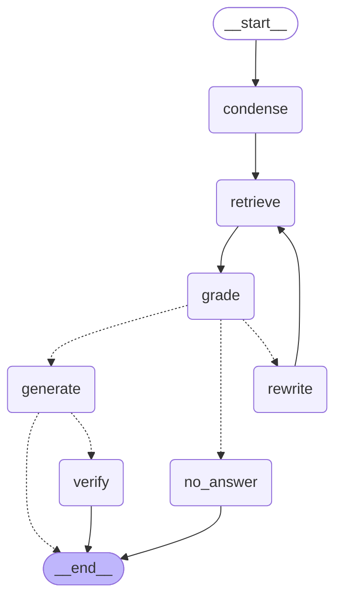

# Architecture

## Overview

```
Browser (static SPA)
   │  REST + SSE      httpOnly session cookie + X-Requested-With header
   ▼
FastAPI  ──────────────►  Postgres + pgvector (Neon / local docker)
   │  enqueue job             ▲  users, auth_sessions, documents,
   │                          │  chunks(vector 768), blobs,
   ▼                          │  jobs (queue), threads, messages
Worker (asyncio)  ────────────┘
   claim job → parse → chunk → embed (batched, throttled) → upsert → ready
        └──► Gemini embeddings API
Chat: LangGraph (retrieve → grade → [rewrite → retrieve]* → generate → verify)
        └──► Gemini generation API
```

Three thin seams keep vendor/infra details out of the rest of the app, each a `Protocol` plus one
implementation, each marked with a `# PROD:` comment at its swap point:

- `BlobStore` (`app/storage.py`) - `PostgresBlobStore`. Production: S3 or GCS.
- `VectorIndex` (`app/vectorindex.py`) - `PgVectorIndex`. Production: Qdrant, Pinecone, or pgvector + HNSW.
- `LLMClient` (`app/llm.py`) - `GeminiClient`. Production: a provider router with fallbacks.

The queue (`app/queue.py`) and auth (`app/auth.py`) are plain modules, not behind seams - there's
only one real implementation worth having for either in this project.

## The chat graph

Built once at startup (`app/rag/graph.py`) and reused across requests; everything request-specific
(user, documents in scope, the question) lives in the graph **state**, not in closures.



Generated with `graph.get_graph().draw_mermaid()` (BUILD_SPEC.md Phase 3 asks for LangGraph's own
export rather than a hand-drawn diagram, so it never drifts from the real graph).

**Nodes:**

- **condense** - rewrites a follow-up into a standalone query using the last 6 messages (helper
  model). Skipped (no LLM call) when there's no history.
- **retrieve** - embeds the standalone query and runs per-document-balanced vector search
  (`VectorIndex.search`), so one large or dominant document can't crowd out the others.
- **grade** - one batched helper-model call marks each candidate passage relevant or not.
- **rewrite** - runs when grading found fewer than `GRADE_MIN_RELEVANT` passages and this is the
  first attempt; rewrites the query and loops back to retrieve. At most once per question.
- **generate** - the main model, **streaming**. Passages are numbered `[1..N]`; the system prompt
  requires citing them and forbids outside knowledge. Tokens are emitted live through LangGraph's
  custom stream writer as they're produced.
- **verify** - only when `ENABLE_GROUNDING_CHECK=true`; runs *after* the full answer has streamed,
  and only produces a grounded/not-grounded badge - it never regenerates.
- **no_answer** - reached when grading still isn't satisfied after one rewrite; a polite refusal,
  never a guess.

**Deviation from BUILD_SPEC section 6.5:** `resolve_scope` (validating that every requested document
id belongs to the user or is public, and is ready) runs in the chat route *before* the SSE stream
opens, not as a graph node. By the time any graph node runs, the HTTP response has already committed
to `200 text/event-stream`, so a `404` for an unknown or foreign document id can only be returned
before that point - there's no way to change the status code mid-stream. The graph itself starts
from `condense`, trusting the already-resolved document ids.

**Streaming → SSE.** The chat route (`app/routes/chat.py`) consumes `graph.astream(state,
stream_mode="custom")` and forwards each writer payload as an SSE event: `step` (node-level
progress, e.g. "searching your documents"), `token` (answer text as it's generated), `citations`,
`grounding`, then a final `done` once the graph finishes and the turn is persisted. A `QuotaExhausted`
from the LLM client becomes an `error` event with code `quota` and a friendly message instead of a
raw stack trace.

## Ingestion sequence

```mermaid
sequenceDiagram
    participant U as User (browser)
    participant A as FastAPI (routes/documents.py)
    participant D as Postgres (documents, blobs, jobs)
    participant W as Worker (app/worker.py)
    participant G as Gemini embeddings API

    U->>A: POST /api/documents (multipart)
    A->>A: validate extension, magic bytes, size/doc/storage caps
    A->>D: INSERT document + blob + job (one transaction)
    A-->>U: 202 Accepted (status=queued)

    loop poll every ~1.5s while not ready/failed
        U->>A: GET /api/documents
        A->>D: SELECT status, progress
        A-->>U: current status
    end

    W->>D: claim job (FOR UPDATE SKIP LOCKED)
    W->>D: load blob bytes
    W->>W: parse (pypdf / python-docx / utf-8) → status=parsing
    W->>W: chunk per page (RecursiveCharacterTextSplitter) → status=chunking
    loop each embedding batch
        W->>G: embed_content (batched, throttled)
        G-->>W: embeddings
        W->>D: UPSERT chunks ON CONFLICT (document_id, chunk_index)
        W->>D: UPDATE documents.progress
    end
    W->>D: UPDATE documents SET status='ready', chunk_count, page_count
    W->>D: UPDATE jobs SET status='succeeded'

    Note over W,D: On crash (SIGKILL) or a transient embedding error, the job stays\nrunning/queued; a maintenance sweep reclaims stale jobs and retries with\nbackoff. The upsert's ON CONFLICT means a reprocessed document never ends\nup with duplicate chunks.
```

## Why these decisions (see also README "Design decisions and trade-offs")

- **No ANN index on `chunks.embedding` (v1).** Retrieval is always restricted to a small, explicit
  set of document ids first (`where document_id = any(...)`), so an exact scan over just those
  documents' chunks is fast at this scale and has no recall loss. HNSW only pays for itself once a
  single document (or the whole corpus searched at once) has enough chunks that a full scan is slow
  - see `docs/PRODUCTION.md` row 1.
- **Blobs in Postgres, not S3.** One free service to run and back up; Render's disk is ephemeral
  anyway, so the alternative for this demo isn't "a disk," it's "a second paid dependency."
- **A hand-written Postgres queue, not Redis/SQS.** No extra service to provision on a free tier,
  durable by construction (it's just rows), and every operation (`claim`, `fail_transient`,
  `reclaim_stale`) is a few lines of SQL that are easy to reason about and to explain.
